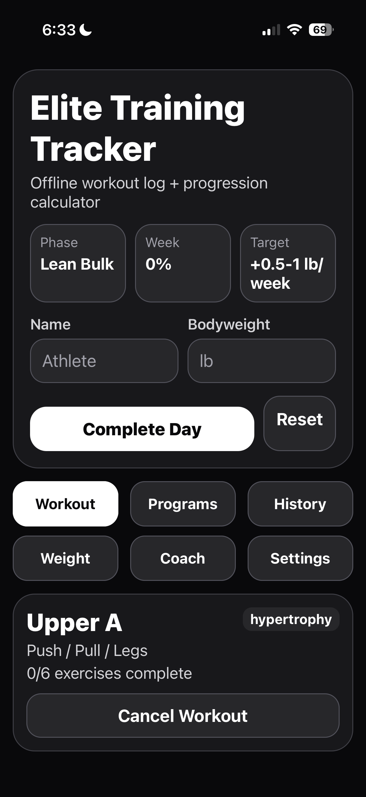
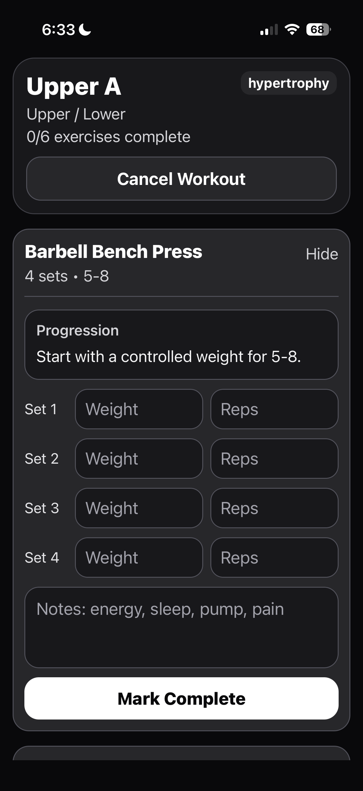
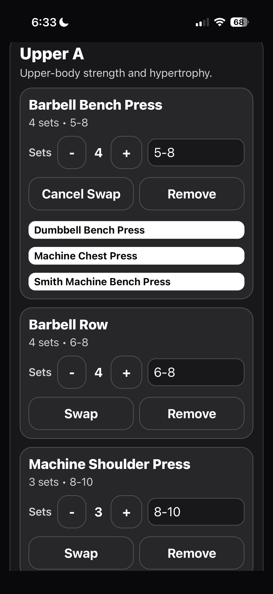
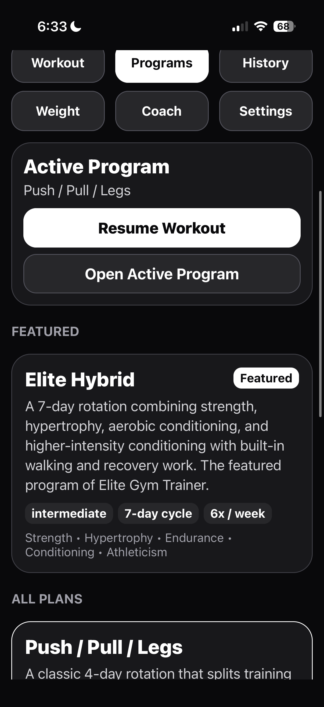
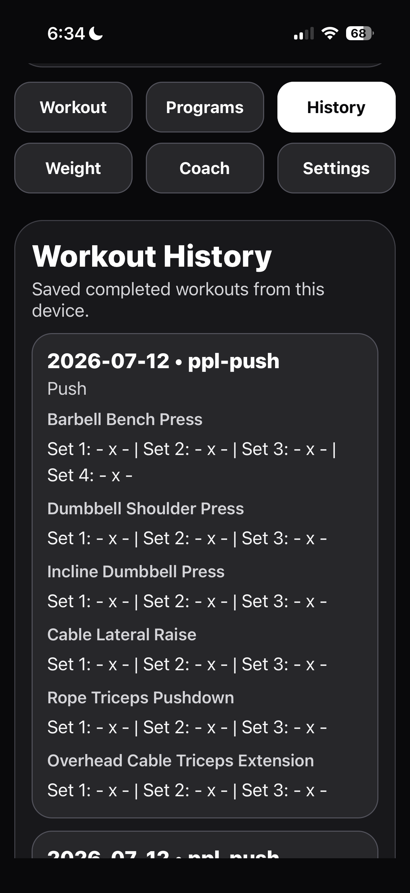
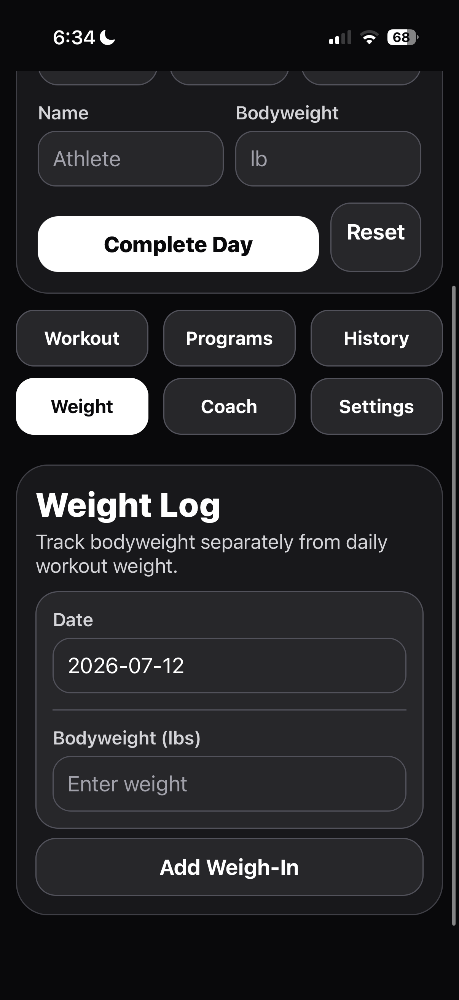
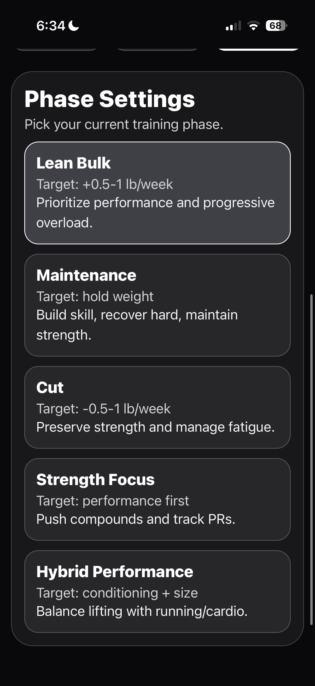

# Elite Gym Tracker

A research-backed workout tracking application built with **React Native, Expo, and TypeScript** that helps lifters make measurable progress through intelligent progressive overload.

Unlike traditional workout trackers that only record sets and reps, Elite Gym Tracker evaluates workout performance and provides actionable feedback on when to increase weight, maintain the current load, or adjust future training.

---

## Screenshots

<table>
  <tr>
    <td align="center"><br /><sub><b>Home</b></sub></td>
    <td align="center"><br /><sub><b>Live Progression</b></sub></td>
    <td align="center"><br /><sub><b>Exercise Swap</b></sub></td>
  </tr>
  <tr>
    <td align="center"><br /><sub><b>Programs</b></sub></td>
    <td align="center"><br /><sub><b>History</b></sub></td>
    <td align="center"><br /><sub><b>Weight Log</b></sub></td>
  </tr>
</table>

<p align="center">
  <br />
  <sub><b>Phase Settings</b></sub>
</p>

---

## Overview

Most workout applications function like digital notebooks.

They show users what they completed, but they do not clearly explain what they should do next.

Elite Gym Tracker was created to solve that problem.

The app uses progressive overload logic to evaluate each completed set and provide feedback based on the selected weight, completed repetitions, and target rep range.

The goal is to help users train more consistently, make better progression decisions, and avoid guessing when it is time to increase weight.

---

## Core Features

### Intelligent Progressive Overload

- Evaluates performance after every completed set
- Detects when the top of a target rep range is reached
- Recommends increasing weight for the next set
- Recommends increasing weight during the next workout
- Encourages users to match performance across all working sets
- Prevents unnecessary weight increases when targets are not met

### Set-by-Set Coaching

The app provides immediate feedback based on performance.

Examples include:

- Increase the weight for the next set
- Maintain the current weight
- Match the completed repetitions across the remaining sets
- Increase the weight during the next workout
- Stay at the current load until the target is achieved

### Workout Logging

- Record weight and repetitions
- Track multiple sets per exercise
- Complete structured workouts
- View exercise-specific feedback
- Move between exercises during an active workout
- Follow predefined training days

### Training Program Structure

- Organized workout days
- Exercise-specific rep ranges
- Multiple working sets
- Progressive overload recommendations
- Strength and hypertrophy-focused programming

---

## Why I Built This

I built Elite Gym Tracker because many fitness applications are either overly complicated or do not provide useful progression guidance.

Logging a workout is helpful, but users still need to decide:

- When should I increase the weight?
- Should I increase weight after one successful set?
- Should I wait until every set reaches the top of the rep range?
- What should I do if my repetitions decrease?
- What weight should I use during the next workout?

Elite Gym Tracker is designed to answer those questions automatically.

This project combines my interest in fitness, artificial intelligence, mobile development, and practical problem-solving.

---

## Progressive Overload Logic

The current progression system evaluates each set independently while also considering the exercise as a whole.

### Earlier Working Sets

When a user reaches the top of the target rep range during an earlier set, the app can recommend increasing the weight for the following set.

Example:

```text
Good job. You reached the top of your target range.
Increase the weight by 5 lbs for the next set.
```

---

## Installation

1. Clone the repository.
2. `cd` into the project folder.
3. Install [Expo Go](https://expo.dev/go) on your iPhone or Android device.
4. Run:

```bash
npm install
npm start
```

5. A QR code will appear.
6. Open Expo Go on your iPhone and scan the QR code.

Your app will open on your phone.

## Important

Your workout data saves locally on your phone inside Expo Go. Later, this can be upgraded to SQLite, cloud sync, charts, PR history, and direct ChatGPT API coaching.
